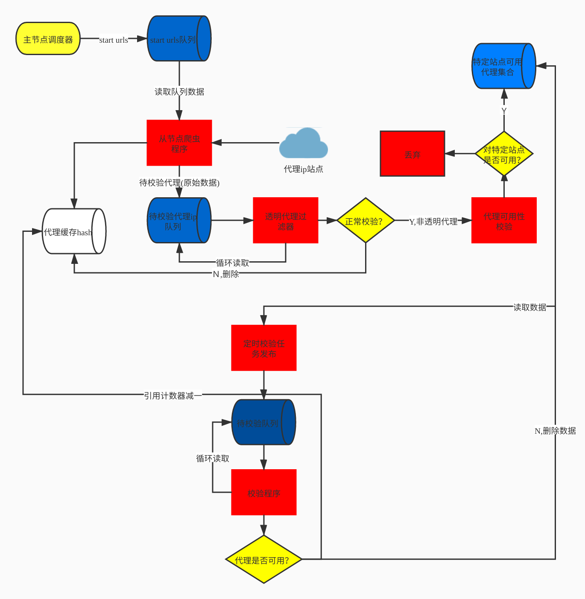

<!--
 * @Author: qinzhonghe96@163.com
 * @Date: 2020-03-14 11:46:32
 * @LastEditors: qinzhonghe96@163.com
 * @LastEditTime: 2020-03-14 13:42:08
 * @Description: 
 -->
## 基于Master-Slave 架构的高可用IP代理池
基于Scrapy-Redis实现的Master-Slave架构的分布式IP代理池，本项目从互联网上抓取可用的高匿代理，您可以通过本项目构建自己的IP代理池。

---


## 特性
- 自定义添加代理来源
- 严格的代理校验过程
- 代理采集与校验异步执行
- 采用灵活的分布式架构，便于扩展
- 各个组件分布式部署

## 工作流程



### 下载安装

1. 先部署redis-cluster  
```按照官方部署流程部署即可```

2. 下载源码  
   ```git clone https://github.com/geebytes/GeeProxy.git```

3. 安装依赖
   ```pip install -r requirements.txt```

4. 修改配置项  
   
- 根据Redis的实际配置修改项目配置文件[GeeProxy/settings.py](GeeProxy/settings.py)中的`REDIS_MASTER_NODES`、`REDIS_PASSWORD`等参数

5. 启动
- 启动主节点: ```python scheduler.py --master --crawl --vaildator --app```
  
- 启动从节点: ```python scheduler.py --slave --crawl --vaildator --no-app```

- 注意事项: 根据实际的部署规划配置[settings.py](settings.py)中的API_SERVER参数，即app节点的服务地址

## 使用方法
- 服务启动后需要进行一段时间的预热过程

- 系统通过API SERVER作为对外提供的接口，服务的默认端口是5000

- 获取某个特定站点的代理
```curl http://127.0.0.1:5000/proxy?usage=imooc```

- 删除某个站点的代理
```curl -v -X DELETE http://127.0.0.1:5000/proxy?usage=imooc&proxy=http://123.123.123.123:8888```

- 获取某个特定站点的代理池  
```curl http://127.0.0.1:5000/pool?usage=imooc```

## 注意事项
- Redis的集群方案当前仅测试集群模式
- 系统依赖于最新版本的[scrapy-redis](https://github.com/geebytes/scrapy_redis_cluster.git)

## TODO
- 补充详细文档
- 性能测试
- 参考用例
- 参数动态化配置
- docker-compose部署方案

## License
[Apache 2.0](GeeProxy/LICENSE)
